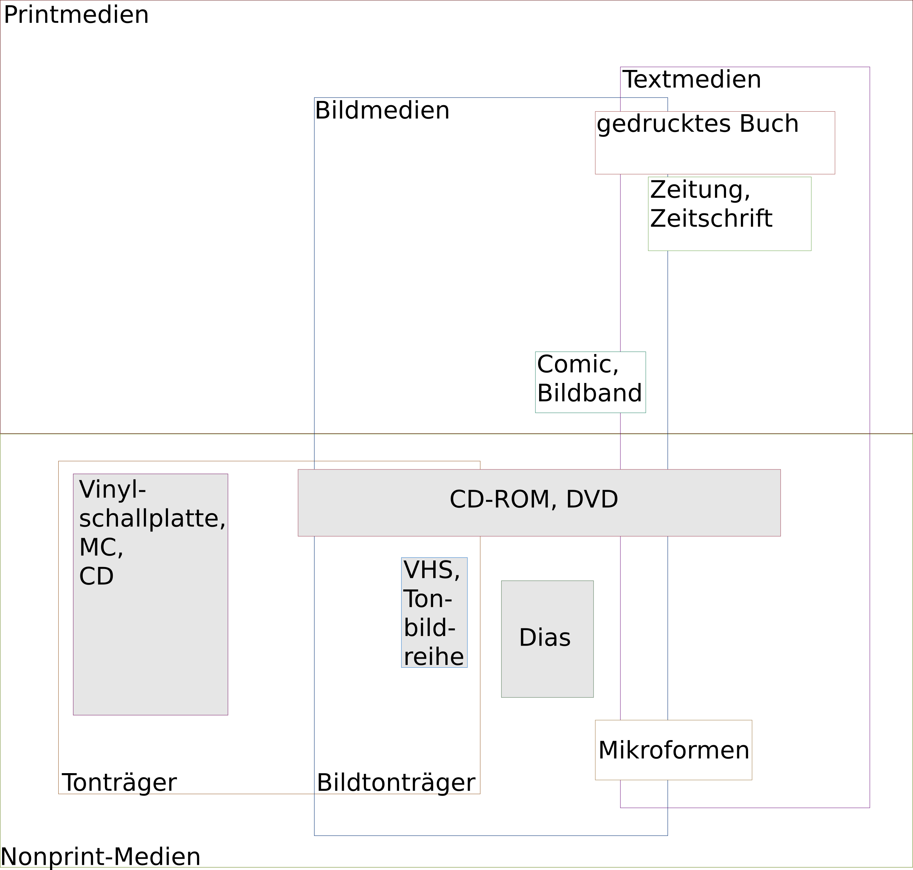
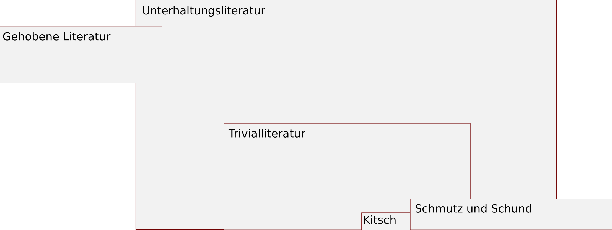

# Bestandsarten

Unterscheidung nach...

  * Medientyp/-art (Träger)
    + Printmedien
    + Nonprintmedien
  * Publikationsform (Erscheinungsweise)
    + Monografien (Erscheint einmalig)
    + Periodika (Zeitungen etc.)
  * Inhalt/Literaturart
    + Kinder- und Jugendliteratur
    + Sachliteratur
    + ...

Für audiovisuelle Medien (AV-Medien) sind Geräte zum Abspielen nötig. Wird ein Computer zur Wiedergabe benötigt, spricht man von elektronischen Medien. 

Wichtige Abkürzungen:

- CD-ROM = Compact Disc - Read Only Memory (Nur lesbar)
- CD-ROM-RW = Comact Disc - Read Only Memory Rewritable (Wieder beschreibbar)
- DVD = Digital Versatil Disc
- USB = Universal Serial Bus

## Nonprint-Medien 

## Primär- und Sekundärliteratur 

| Primärliteratur                                         | Sekundärliteratur                        |
| ------------------------------------------------------- | ---------------------------------------- |
| Originalarbeiten                                        | Beschäftigt sich mit der Primärliteratur |
| Kann Gegenstand der wissenschaftlichen Forschung werden | Erklärt und/oder interpretiert           |
| z.B. Werke eines Autors, Quellenwerke                   | z.B. Kommentare, Lehrbücher              |

## Selbstständige und Unselbstständige Literatur 

| Selbstständige Literatur                      | Unselbstständige Literatur                      |
| --------------------------------------------- | ----------------------------------------------- |
| meist ein Autor                               |                                                 |
| inhaltlich und physisch in sich abgeschlossen | Teil eines Gesamtwerks                          |
| Einzelne Veröffentlichung                     | Veröffentlichung in Zeitschriften, Sammelwerken |
| Eigener Titel, eigene iSBN                    | Kein eigener Titel, keine eigene ISBN           |
| z.B. Monografien, Dissertationen              | z.B. Aufsätze                                   |

## Sachliteratur 

### Definition 

Sachbuch im weiteren Sinne:

  * kein fiktionaler Inhalt, keine Kinder(-sach-)bücher, keine Comics
  * informierender, analysierender oder reflektierender Charakter steht im Vordergrund
  * bspw. wissenschaftliche Werke, Foto- oder Kunstbildbände, praktische Anleitungen, Lehrbücher
  * auch: Sach- und Fachliteratur
  * engl.: non fiction

Sachbuch im engeren Sinne:

  * vermittelt in zusammenhängender Darstellung Kenntnisse, Tatsachen, Werte, Sichtweisen und Meinungen an ein nicht fachspezifisches Publikum
  * allgemein verständlich geschrieben
  * dient der Wissenspopularisierung, Wert- und Sinnorientierung, Meinungsbildung
  * steht dem Alltagsbewusstsein nahe
  * zentrale Buchgattung für ÖBs, für WBs zu wenig Informationen
  * Autoren teilweise Wissenschaftler, meist (Wissenschafts-)Journalisten
  * Nutzung durch 49% der Bevölkerung
  * Übergang zu Fachbuch, Ratgeber, wissenschaftlichem Buch ist fließend
  * Titelformulierungen oft eingängig, Neugier weckend, Stellung beziehend
  * Zusatz zum HST: Thema mit nüchternen Worten angegeben
  * kaum Fußnoten, Quellenangaben, Register, Literaturverzeichnisse
  * fesselnde Schreibweise
  * Darstellung sachlich einwandfrei

### Buchgattungen der Sachliteratur 

  * Populäres Sachbuch (= Sachbuch im engeren Sinne)
  * Fachbuch
  * wissenschaftliches Buch
  * Handbuch
  * Lexikon
  * Sprachwörterbuch
  * Lehr-, Lern- und Übungsmaterialien
  * Schulbuch
  * Ratgeber, Anleitung
  * Biographie
  * Reiseführer
  * Atlas
  * Bildband
  * Quellenwerk, Normensammlung, Gesetzessammlung, Gesetzeskommentar
  * Fakten-, Namen- Waren-, Bildverzeichnis
  * Bibliografie, Bibliothekskatalog

## Nachschlagewerke 

### Dissertation 

  * schriftliche wissenschaftliche Arbeit
  * Voraussetzung zur Erlangung eines Doktorgrades
  * meist neue wissenschaftliche Erkenntnisse zu meist sehr speziellen Thema

### Enzyklopädie 

  * relativ ausführliche Artikel
  * Literaturnachweise
  * Allgemeines Wissen, fachspezifisches Wissen

### Fakten- und Zahlensammlung 

  * Nachschlagen statistischer Angaben und wichtiger Zahlen
  * bspw. statistische Jahresberichte, Orts- und Namensverzeichnisse, Almanache

### Forschungsbericht/Report 

  * Ergebnisse, Stand oder Fortschritte
  * nicht immer für die Öffentlichkeit zugänglich

### Habilitation 

  * wissenschaftliche Arbeit
  * Erwerb der Lehrberechtigung i.d.R. für eine Professur

### Handbuch 

  * Wissen eins Fachgebiets systematisch geordnet
  * Überblick über Inhalte und Entwicklung eines speziellen Themas oder Fachgebiets
  * kann mehrbändig sein
  * kann von mehreren Wissenschaftlern geschrieben sein

### Konferenzbericht 

  * verschriftliche Vorträge einer Tagung

### Lehrbuch 

  * grundlegendes Wissen eines Fachs
  * aktueller Forschungsstand
  * einfache Darstellung
  * didaktische Aufbereitung

### Lexikon

  * kürzere Artikel zum Lemma
  * keine Literaturnachweise
  * meist alphabetische Ordnung
  * Allgemeines Wissen oder fachspezifisches Wissen (Themenkreis)

### Monographie

  * einzelnes, begrenztes Thema
  * in sich abgeschlossene, selbstständige Veröffentlichung

### Wörterbuch

  * Vermittlung sprachlichen Wissens
  * Rechtschreibung, Synonyme, Fremdwörter

## Belletristik

Bei Belletristik handelt es sich um erzählerisches Schrifttum mit unterschiedlichem Niveau. Von franz. "belle lettre" = schöne Literatur, oft auch Unterhaltungsliteratur etc.

### Einteilung
Belletristik wird von Wissenschaftlern und Kritikern unterschiedlich eingeteilt. Der Versuch einer Übersicht:

### Trivialliteratur

Trivialliteratur meint auf der Straße befindliche, d.h. allgemein zugängliche, gewöhnliche Literatur; Es schwingt die Einschätzung mit, Trivialliteratur sei "banal".

### Synonyme 

  * Gebrauchsliteratur
  * Subliteratur
  * ...

### Funktionen 

  * Katharsis
  * Freizeitgestaltung
  * Entspannung
  * Sprachbildung, Sprachentwicklung
  * Wissensvermittlung
  * (Kritische) Auseinandersetzung mit Themen
  * Emotionsverstärkung
  * Lust auf Abenteuer (z.B. auch "Leseabenteuer")
  * Idylle, Flucht in Scheinwelten, Lesen als Genussmittel
  * Pflege des kulturellen Erbes
  * Leseförderung
  * Anregung der Phantasie

### Vergleich von Hoch- und Trivialliteratur

| Hochliteratur                                                | Trivialliteratur                                         |
| ------------------------------------------------------------ | -------------------------------------------------------- |
| "Das besondere Buch"                                         | allgemeinverständliche Stoffe, publikumswirksame Inhalte |
| Bestimmte Schreibweisen (Lyrik, ...)                         |                                                          |
| Klassiker (Goethe, Schiller, ...)                            |                                                          |
| Bestimmte Autorengruppen                                     |                                                          |
| Große Personengruppen, Vielfältigkeit individueller Figuren  |                                                          |
| Ernsthafte Konflikte                                         |                                                          |
| Problematisiertes Weltbild                                   | Überschaubares Weltbild ("Heile Welt")                   |
| "Halbfertige" Helden (Figuren machen eine Entwicklung durch) | "Wohlanständige" Helden (Von Beginn an Helden)           |

### Genres der Unterhaltungsliteratur (auch: Interessenskreise)

  * Kriminalroman
  * Abenteuerroman
  * Utopische/Phantastische Romane
  * Natur
  * Heimat
  * Engagierte feministische Literatur
  * Grusel
  * Horror
  * Erotik
  * Liebesromane
  * Historische Romane
  * Familienromane
  * Heiteres
  * ...

### Unterteilung nach Gattung in Bibliotheken

**Epik:**

- Romane

- Erzählungen

- Kurzgeschichten

- Novellen

- ...

  &#10132; Erzählerische Werke **eines** Verfassers

**Lyrik:**

- Gedichte

- Balladen

- ...

  &#10132; Gedichte **eines** Verfassers

**Drama:**

- Bühnenwerke

- Texte für Laiengruppen

- ...

  &#10132; Dramen **eines** Verfassers

**Anthologie:**

- Geographische Zusammenstellungen

- Personelle Zusammenstellungen (Texte einzelner Autor:innen/-gruppen)

- Thematische Zusammenstellungen

  &#10132; Belletristische Werke **mehrerer** Verfasser

## Audiovisuelle Medien (AV-Medien)

AV-Medien lassen sich in drei Gruppen einteilen:
  - Auditiv (Tonträger)
  - Visuell (Bildträger)
  - Audiovisuell (Bildtonträger)

