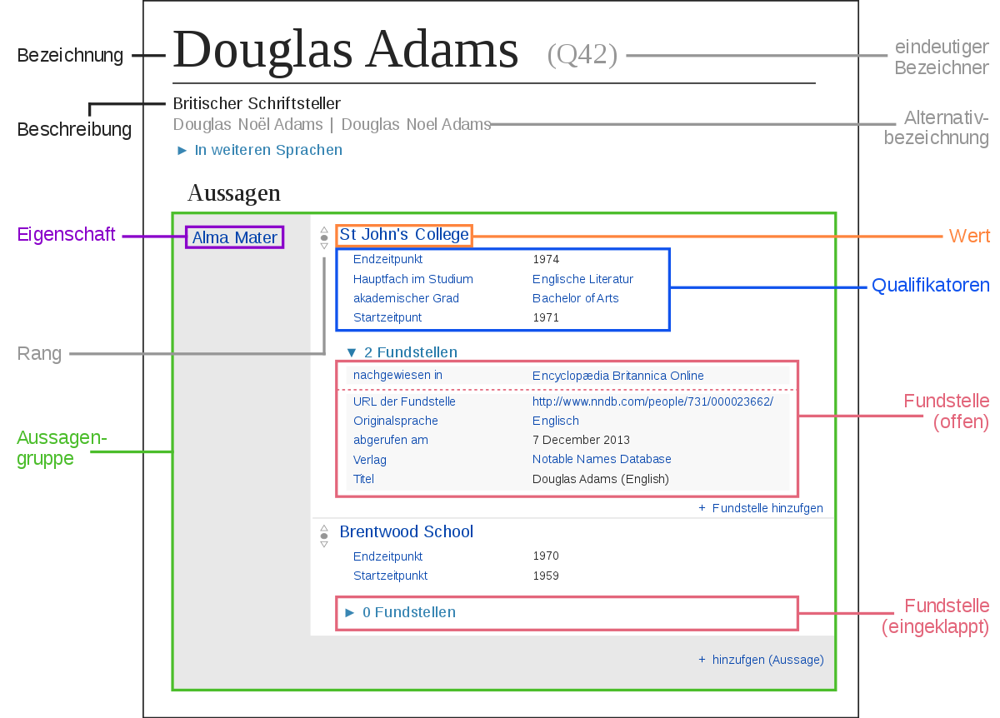

# Wikidata

[Übersicht in der Wikipedia](https://de.wikipedia.org/wiki/Wikidata)

## Datenmodell



Grafik: [Charlie Kritschmar (WMDE), CC0, via Wikimedia Commons](https://commons.wikimedia.org/wiki/File:Datamodel_in_Wikidata_de.svg)


## Abfragen (Wikidata Query Service)

(Auch) Graphisches Interface zum einfacheren Erstellen von Abfragen: [Wikidata Query Service](https://query.wikidata.org/)

Die Abfrage fühlt sich allerdings, wenn man bspw. die Suche im GVK über WinIBW gewohnt ist, recht lahm an.


### Geographische Abfragen

Seit 09.05.2016, siehe [hier](https://lists.wikimedia.org/pipermail/wikidata/2016-May/008704.html)

Beispiel von Christian Hauschke: [Bibliotheken im Umkreis von 100km von Hannover](https://query.wikidata.org/#%23%20Libraries%20in%20and%20around%20Hannover%0A%23defaultView%3AMap%0ASELECT%20%3Fplace%20%3FplaceLabel%20%3Flocation%20WHERE%20{%0A%20%20wd%3AQ1715%20wdt%3AP625%20%3Fhannover.%0A%20%20SERVICE%20wikibase%3Aaround%20{%0A%20%20%20%20%3Fplace%20wdt%3AP625%20%3Flocation.%0A%20%20%20%20bd%3AserviceParam%20wikibase%3Acenter%20%3Fhannover.%0A%20%20%20%20bd%3AserviceParam%20wikibase%3Aradius%20%22100%22.%0A%20%20}%0A%20%20%3Fplace%20%28wdt%3AP31%2Fwdt%3AP279*%29%20wd%3AQ7075.%0A%20%20SERVICE%20wikibase%3Alabel%20{%20bd%3AserviceParam%20wikibase%3Alanguage%20%22en%22.%20}%0A})

Eine Abfrage nach Archiven im Umkreis von 50km um [Aurich (Wikidata-Link)](https://www.wikidata.org/wiki/Q14839):

```SPARQL
SELECT ?place ?placeLabel ?location WHERE {
  wd:Q14839 wdt:P625 ?aurich.
  SERVICE wikibase:around {
    ?place wdt:P625 ?location.
    bd:serviceParam wikibase:center ?aurich.
    bd:serviceParam wikibase:radius "50".
  }
  ?place (wdt:P31/wdt:P279*) wd:Q166118.
  SERVICE wikibase:label { bd:serviceParam wikibase:language "en". }
}
```

(bei Wikidata auch mit Syntax-Highlighting)